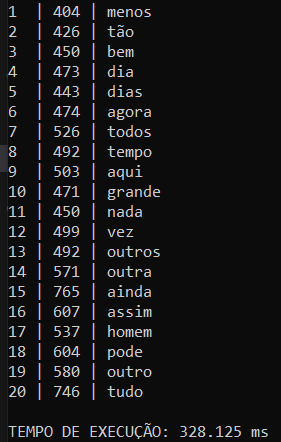

<h1 align="center" font-size="200em"><b>Top K elementos - Análise textual</b></h1>

<div align = "center" >

[](https://code.visualstudio.com/docs/?dv=linux64_deb)


</div>

## Introdução
<p align="justify">
Este é um programa desenvolvido em C++ para a disciplina de Algoritmos e Estruturas de Dados II. 
Um exemplo clássico de problema que pode ser solucionado utilizando-se hash e heap é o chamado top k itens. Neste problema, é preciso encontrar os k itens mais valiosos e uma coleção de dados. Logo, utiliza-se o hash para contar a frequência de todos os itens, enquanto o heap se aplica na manutenção de uma lista dos k itens de maior valor.
</p>

## Objetivos
<p align="justify">
O objetivo desse trabalho é encontrar as palavras mais frequentes num conjunto de textos, utilizando as estruturas tabela de dispersão (hash) e árvore de prioridades (heap). Para tal, as seguintes operações são realizadas:

- É criada uma tabela de dispersão (hash) para contar a frequência de cada elemento tokenizado da coleção de dados de entrada;
- É criada uma árvore de prioridades (heap) de tamanho k e são inseridos nela os primeiros k elementos da hash;
- Para cada elemento restante na hash, é comparada sua contagem com o menor valor do heap;
- Se a contagem for maior do que o menor valor da heap, o menor valor é removido, o novo elemento é inserido e a estrutura é refeita;
- Caso contrário, o elemento é ignorado;
- No final, a heap conterá os k elementos com maiores valores (frequências) da coleção de dados.
</p>

## Arquivos
- ```src```:
    - ```palavra.hpp```: Classe que representa cada palavra lida;
    - ```functions.hpp```: Assinatura das funções;
    - ```functions.cpp```: Implementação das funções;
    - ```main.cpp```: Leitura dos arquivos e contrução/manutenção da hash e do heap.
- ```dataset```: 
    - ```DC.txt``` e ```SMA.txt```: Bases de dados iniciais;
    - ```stopwords.txt```: Lista de stop words a serem ignoradas durante a leitura do arquivo. 

## Funções
- ```addMap```: Adiciona uma palavra em um unordered map (hash). Caso ele já esteja contido no map, o seu número de ocorrências é incrementado;
- ```isStopWord```: Verifica se a palavra está contida no unordered map que guarda as stop words a serem ignoradas;
- ```criarHeapK```: Adiciona os K primeiros elementos da hash num vector, utilizado como base para o heap;
- ```buildHeap``` e ```rebuildHeap```: Constroem o heap de acordo com a regra que os filhos do índice i são os índices (2i + 1) e (2i + 2). Se o número de ocorrências do pai for maior do que o do filho, eles trocam de lugar e chama-se a ```rebuildHeap``` novamente. Dessa forma, após a chamada da função ```buildHeap``` garante-se que o menor número está na primeira posição do vector;
- ```Swap```: Troca dois ponteiros;
- ```check```: Percorre o mapa até o fim. Caso a palavra atual tenha frequência maior do que o primeiro elemento do vector, eles trocam de lugar e o heap é refeito através da chamada de ```buildHeap```.

## Implementação da hash usando ```unordered_map```

## Resolução do problema

### A classe Palavra
No arquivo ```palavra.hpp```, define-se a classe que representa todas as palavras lidas dos textos, que contém os seguintes atributos: ```string texto```, para salvar a palavra propriamente dita, e ```int ocorrencias```, um contador que indica o número de ocorrências daquela palavra. 

Na linha 11 deste mesmo arquivo, define-se a constante ```K```, que informa o tamanho da lista de palavras mais frequentes.
### Leitura dos arquivos
Os arquivos a serem lidos pelo programa estão contidos na pasta ```dataset```. Na linha 7 do arquivo ```main.cpp```, define-se uma constante (```NUMERO_ARQUIVOS```) que indica o número de arquivos que serão manipulados, e na linha 13 declara-se estaticamente um vetor de strings que contém os nomes dos arquivos. Caso o usuário deseje adicionar ou remover arquivos de dados, deve-se alterar a constante ```NUMERO_ARQUIVOS``` e incluir os nomes no vetor.

Antes de percorres os arquivos com os textos, lê-se um arquivo (```stopwords.txt```) que indica todas as stop words a serem ignoradas. Como não há repetições, cada palavra lida é adicionada ao ```unordered_map stopWordMap```.

Dentro do loop que percorre o vetor de nomes dos arquivos, acontecem os seguintes procedimentos:
- Abertura do arquivo;
- Leitura de uma linha;
- Remoção de caracteres especiais;
- Tokenização da linha, ou seja, separação das palavras;
- Caso a palavra não esteja no ```unordered_map stopWordMap```, ela é adicionada ao ```wordMap``` (hash principal);
- Fechamento do arquivo

### Adicionando as palavras na hash
#### Função ```addMap```
Caso a palavra já exista no ```wordMap```, seu número de ocorrências é incrementado. Caso contrário, cria-se uma nova instância da classe Palavra, seu texto é inicializado com o token passado como parâmetro, suas ocorrências são inicializadas em 1, e a adição ao map propriamente dita é feita. A chave de acesso é a própria string e o conteúdo é a nova instância da classe Palavra.

### Criação e manutenção do heap
Com a função ```criarHeapK```, percorre-se os K primeiros itens do ```wordMap```, e eles são inseridos no vector ```vetorPalavras```. Esse procedimento inicial é necessário para setorizar os primeiros elementos a serem comparados com o restante das palavras e criar a estrutura onde se manterá o heap.
Na função ```check```, verifica-se o número de ocorrências do resto dos elementos do ```wordMap```, e caso um deles seja maior que o do primeiro item do vetor, este troca de lugar com o elemento atual do ```wordMap``` e o heap é reconstruído. Ao final do ```wordMap```, os K elementos contidos no vetor serão os de maior ocorrência, já que permaneceram na estrutura após todas as reconstruções do heap e seus números de ocorrência não são menores do que os outros elemtentos do ```wordMap```.

#### ```buildHeap```
Função principal de construção do heap. Define-se o "pai" como o índice ((tamanho do vetor de palavras / 2) - 1), compara-se esse elemento com o restante do vetor e o índice é decrementado até 0, o que define os outros itens "pai".

#### ```rebuildHeap```
Compara do elemento atual com o restante do vetor. Vefica-se se um segundo filho (filho + 1) existe e se o número de ocorrências do filho é maior que o do filho 2. Caso positivo, o filho é incrementado em 1 (filho = filho 2), de modo a garantir que o filho com o menor número de ocorrências é escolhido.

Vê-se também se o elemento atual tem o número de ocorrências maior do que o número de ocorrências do filho. Se sim, o elemento atual e o filho trocam de lugar, fazendo com que o menor valor esteja na primeira posição do vetor.

## Resultados
Entrada: textos "DC.txt" e "SMA.txt".
<br>Resultado esperado:<br><br>


## Conclusão
A partir desse trabalho, foi possível concluir que o uso de hash para contar a frequência dos elementos e heap para manter a lista dos k elementos com maiores valores provou-se um método rápido e simples. O método também se mostra adequado pelas suas características de uso de tempo e espaço: o tempo de execução foi muito pequeno para a entrada determinada e apenas duas estruturas foram necessárias para a obtenção da informação buscada, ou seja, houve pouco espaço consumido.

## Referências

## Compilação e execução
* Especificações da máquina em que o código foi rodado:
  * Processador Intel Core i5, 7th Gen;
  * Sistema Operacional Windows 10;
  * Terminal do WSL: Ubuntu 20.04.5;
  * 8GB de RAM.
* | Comando                |  Função                                                                                           |                     
  | -----------------------| ------------------------------------------------------------------------------------------------- |
  |  `make clean`          | Apaga a última compilação realizada contida na pasta build                                        |
  |  `make`                | Executa a compilação do programa utilizando o gcc, e o resultado vai para a pasta build           |
  |  `make run`            | Executa o programa da pasta build após a realização da compilação                                 |

## Contato
<div>
 <p align="justify"> Julia Rezende Gomes Rocha</p>
 <a href="https://t.me/juliarezende34">
  
 </div>
 <br>
<a style="color:black" href="mailto:juliarezende34@gmail.com?subject=[GitHub]%20Source%20Dynamic%20Lists">
✉️ <i>juliarezende34@gmail.com</i>
</a>